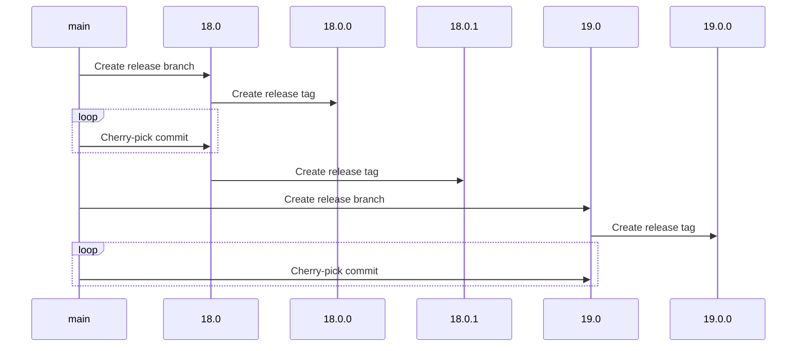

# Keycloak release workflows

This repository contains workflows for releasing Keycloak, including:

* Feature releases
* Patch releases
* Nightly releases

## Feature release

Keycloak doesn't currently leverage the `minor` component in [Semantic Versioning](https://semver.org/), but rather always bumps the `major` version.

To prepare for a new feature release the first step is to prepare release branches. This will be done through a workflow that creates release branches for all repositories.

